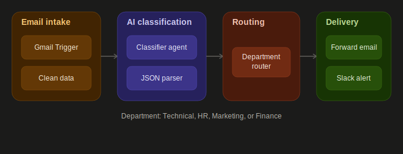

# Intelligent Email Routing System

An n8n workflow that automatically reads incoming emails, classifies them using AI, and routes them to the correct department via Slack notification and Gmail forwarding.



## Overview

Support inboxes that serve multiple departments quickly become a bottleneck — every email has to be read and manually forwarded to Technical, HR, Marketing, or Finance before anyone can act on it. This workflow solves that by monitoring the inbox continuously, using an AI model (Google Gemini) to classify each email by intent and context, and automatically forwarding it to the correct department's inbox while posting a real-time Slack notification to that team's channel.

## Prerequisites

- n8n (v1.0 or later recommended)
- Gmail OAuth2 credentials
- Google Gemini API key (model used: `gemini-flash-latest`)
- Slack OAuth2 credentials, with a channel created per department
- Department inbox addresses to forward routed emails to

## Setup Instructions

1. **Import the workflow** — In n8n, go to Workflows → Import → paste or upload `workflow.json`
2. **Configure credentials** — Connect the following in the credentials panel:
   - Gmail OAuth2 (used by the `Email from Customer` trigger and the four department forwarding nodes)
   - Google Gemini (PaLM) API (used by the `Google Gemini Chat Model` node)
   - Slack OAuth2 (used by the four `Send a message` notification nodes)
3. **Set department destinations** — Open each of the four Gmail forwarding nodes (`Technical email`, `HR email`, `marketing email`, `finance email`) and update the `sendTo` field with your real department inbox addresses.
4. **Set Slack channels** — Open each Slack `Send a message` node and point `channelId` at your actual department Slack channels (e.g. `#finance-department-team`, `#hr-department-team`).
5. **Review the classifier prompt** — Open the `Email Classifier Agent` node and confirm the four department names in the system prompt match the categories you want to route into (default: Technical, HR, Marketing, Finance).
6. **Activate the workflow** — Toggle the workflow to Active. It polls the connected Gmail inbox every minute for new emails.

## Classifier prompt used

**System message** (`Email Classifier Agent` node):

```
you are Richard, an email classification assistant.

##Task

your task is to analyze incoming emails and determine which department they belong to.

The possible department are strictly: "Finance", "HR", "Marketing", or "Technical".

Return the result only in a valid JSON object with these keys:

- department: one of the four departments
- subject: same subject text received
- body: same body text received
- sender: same sender text received

Do not include any explanations or extra text. Return JSON only
```

**User message passed to the agent**:

```
body: {{ $json.body }}, subject: {{ $json.subject }}, sender: {{ $json.sender }}
```

The agent is backed by the `Google Gemini Chat Model` node (`gemini-flash-latest`) and is expected to return strict JSON only, with no surrounding explanation, so it can be parsed directly downstream.

## Workflow Logic

1. **Email from Customer (Gmail Trigger)** — Polls the connected Gmail inbox every minute for new messages.

2. **Clean Data (Code node)** — Extracts and normalizes the fields needed downstream from the raw Gmail payload: `sender` (From), `subject` (Subject, defaults to empty string if missing), and `body` (Gmail snippet).

3. **Email Classifier Agent (AI Agent)** — Passes the cleaned sender, subject, and body to Google Gemini using the system prompt above. The model returns a JSON object containing the classified `department` plus the original `subject`, `body`, and `sender` fields, so nothing is lost in translation.

4. **Json Parser (Code node)** — Parses the raw string output from the agent (`$input.first().json.output`) into a usable JSON object via `JSON.parse()`.

5. **Department Router (Switch node)** — Routes the parsed item down one of four outputs based on an exact, case-insensitive string match on `department`: `Technical`, `HR`, `Marketing`, or `Finance`.

6. **Department-specific Gmail forward** (`Technical email` / `HR email` / `marketing email` / `finance email`) — Each branch forwards the email to its department inbox, reusing the original subject (from the parsed JSON) and body (from the cleaned data), with `replyTo` set to the original sender so replies go straight back to the customer.

7. **Department-specific Slack notification** (`Send a message` / `Send a message1` / `Send a message2` / `Send a message3`) — In parallel with the forward, each branch also posts a formatted Slack message (sender, subject, body) into that department's dedicated channel, so the team is alerted immediately rather than relying on someone checking the inbox.

## Notes

- **Classification basis** — The model classifies using the Gmail snippet (roughly the first ~200 characters of the email) rather than the full body. For longer or more nuanced emails, consider adding a Gmail `Get Message` node before classification to pass the full body for higher accuracy.
- **Strict JSON output** — The classifier prompt explicitly forbids any explanation text in the response, since the very next node (`Json Parser`) does a hard `JSON.parse()` with no error handling. If you change the prompt, keep "Return JSON only" intact or add try/catch handling to the parser.
- **No duplicate-routing protection** — Unlike workflows that apply a "Processed" label after handling an email, this version doesn't currently mark emails as handled, so it relies on the Gmail Trigger's normal polling behavior to avoid reprocessing. If you need stronger duplicate protection, consider adding a label-based check similar to other workflows in this portfolio.
- **Department names are case-insensitive but must match exactly otherwise** — The Switch node's `ignoreCase: true` setting means "technical" and "Technical" both route correctly, but a typo or synonym (e.g. "IT" instead of "Technical") will fall through with no route, since there's no default/fallback branch configured.
- **Polling interval** — Currently set to every minute. Adjust in the Gmail Trigger node based on your email volume and n8n plan execution limits.

## Stack

n8n · Gmail · Google Gemini (`gemini-flash-latest`) · Slack · n8n Code nodes (JavaScript) for data cleaning and JSON parsing
